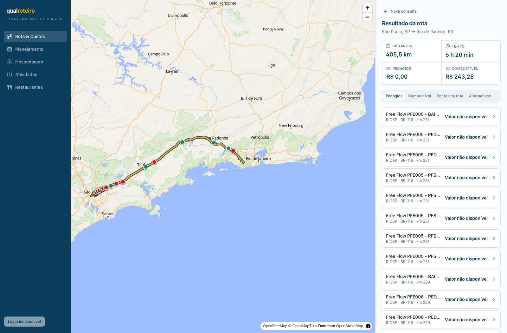
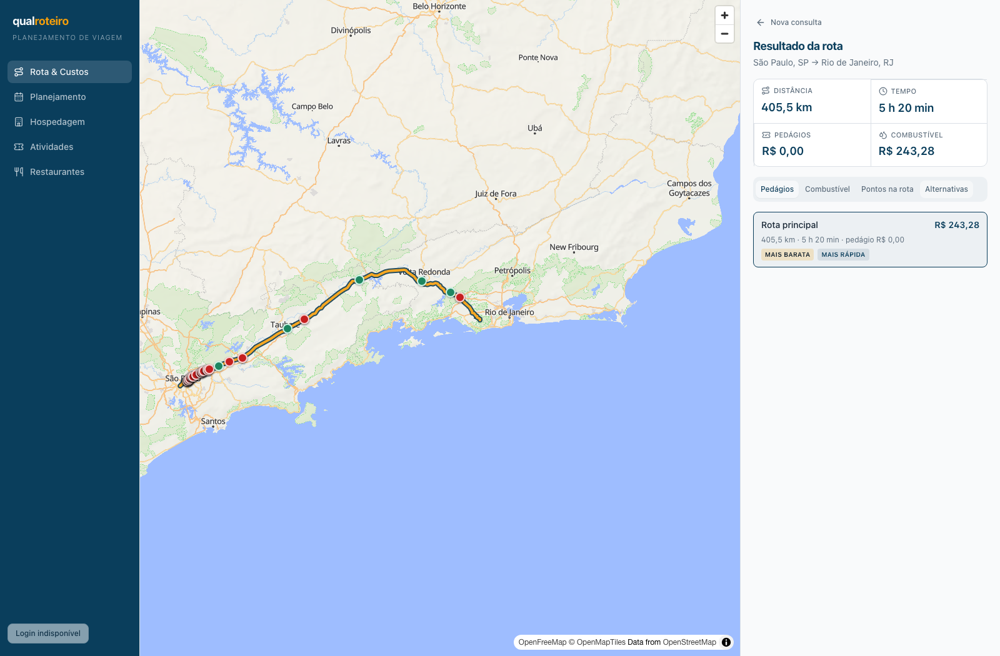

# Rota & Custos — estabilidade da TabsList (2026-09-16)

## Entrega

- Base: `origin/main` em `5fa985a` (PR #38, antes desta alteração).
- Branch: `codex/fix-rota-tabs-long-list`.
- Alteração: em `ResultScreen`, `Tabs` deixa de encolher no eixo vertical
  (`flex-none`) e a `TabsList` recebe `min-h-10 shrink-0`. Os triggers continuam
  com largura mínima de conteúdo e a rolagem horizontal fica limitada à faixa de
  abas (`overflow-x-auto`). A rolagem vertical permanece no painel externo; não
  há área vertical interna nova.
- Regressão permanente: `apps/web/e2e/rota-custos-tabs.spec.ts`, com resposta
  determinística de 61 praças, medidas por `getBoundingClientRect()` e cobertura
  de teclado/rolagem. Runner e comando: `@playwright/test` + `pnpm --filter
  @qualroteiro/web test:e2e`.

## Verificação real — Dutra, sem demo

Ambiente: API da branch em `:3004`, conectada ao Postgres local
`qualroteiro` na porta `5433`; web da branch em `:5177`; Chromium via
Playwright 1.63.0. `VITE_DEMO_MODE` não foi definido.

O `POST /routes/plan` para São Paulo, SP → Rio de Janeiro, RJ retornou **1
rota, 61 praças em `tolls.plazas` e `points.tolls`, total R$ 0,00**. Não houve
`pageerror` nem `console.error` durante a sessão.

| Viewport | TabsList | Largura/overflow | Resultado |
| --- | --- | --- | --- |
| 1600×1050 | 40 px | 375/375 px; sem overflow horizontal da página | quatro tabs contidos; Pedágios e Alternativas mantêm 40 px |
| 1280×720 | 40 px | 375/375 px; sem overflow horizontal da página | quatro tabs contidos; lista rola no painel |
| 390×844 | 40 px | 358/358 px; sem overflow horizontal da página | quatro tabs contidos; navegação por seta direita testada |

Capturas revisadas manualmente:

| Pedágios longo (1600×1050) | Alternativas (1600×1050) |
| --- | --- |
|  |  |

| Pedágios longo (1280×720) | Mobile — início | Mobile — fim da lista e total |
| --- | --- | --- |
| [captura](evidence/desktop1280-pedagios-long.png) | [captura](evidence/mobile390-pedagios-long.png) | [captura](evidence/mobile390-end-of-list.png) |

No mobile, a última praça e o bloco **“Total de pedágios — R$ 0,00”** foram
alcançados por rolagem da página; no desktop a rolagem é do painel de custos,
como antes. O mesmo canvas persistiu ao trocar abas. No toggle real de
Pedágios, os marcadores passaram de 66 para 5 e voltaram a 66: os 5 restantes
são camadas não-pedágio, provando a remoção/restauração dos **61** marcadores
da Dutra. A suíte unitária existente cobre também Tela 1 → Tela 2 → Tela 1.

## Critérios de aceite

| ID | Resultado | Evidência |
| --- | --- | --- |
| AC-1 | PASS | 61 praças reais; barra 40 px; quatro triggers de 28 px inteiramente contidos (tolerância de 1 px). |
| AC-2 | PASS | 1600 px: todos os rótulos visíveis, `scrollWidth === clientWidth`; Pedágios/Alternativas mediram 40 px. |
| AC-3 | PASS | 1280×720 e 390×844: sem corte vertical, sem overflow horizontal de página; `ArrowRight` move foco de Pedágios para Combustível. |
| AC-4 | PASS | E2E determinístico cobre 61 e última praça/total; testes unitários existentes cobrem 0 (`EMPTY_TOLLS_ROUTE`) e 1 (`TARIFFLESS_ROUTE`) praça. |
| AC-5 | PASS | Sessão real preservou o mesmo canvas entre abas e o toggle mudou 66→5→66 (61 pedágios removidos/restaurados); `rotaCustos.test.tsx` preserva a navegação persistente. |
| AC-6 | PASS | Testes preservam nomes, copy ANTT, fallback de oito categorias no drawer e total zero sem tarifas. |
| AC-7 | PASS | Sem erros de página/console na sessão real; testes, lint, typecheck, build e e2e passam. |
| AC-8 | PASS | Este relatório vincula comandos, resultados, evidências e limites. |

## Comandos executados

```sh
pnpm --filter @qualroteiro/web test
pnpm --filter @qualroteiro/web lint
pnpm --filter @qualroteiro/web typecheck
pnpm --filter @qualroteiro/web build
pnpm --filter @qualroteiro/web test:e2e
```

Resultados: **129 testes unitários passaram**, lint/typecheck/build passaram
(apenas o aviso pré-existente de chunk MapLibre maior que 500 kB), e a regressão
Playwright passou.

## Limites

- O teste e2e permanente intercepta somente `POST /routes/plan` com fixture
  determinística longa. Isso elimina dependência do provedor para a regressão de
  geometria/layout; a seção “Verificação real” é a confirmação separada contra
  API, Postgres e dados ANTT reais.
- O ambiente local inicialmente apontava à porta `5432`, que pertence a outro
  Postgres e retornou um resultado divergente. A evidência acima usa a porta
  publicada do Postgres `qualroteiro` (`5433`) e registra o pré-requisito
  confirmado de 61 praças.

## Log de progresso

- 2026-09-16: reproduzido o encolhimento vertical pela relação flex entre o
  painel rolável e `Tabs`; implementada correção local em `ResultScreen`.
- 2026-09-16: adicionada regressão Playwright de 61 registros; verificação real
  Dutra concluída em desktop e mobile, sem modo demonstração.
