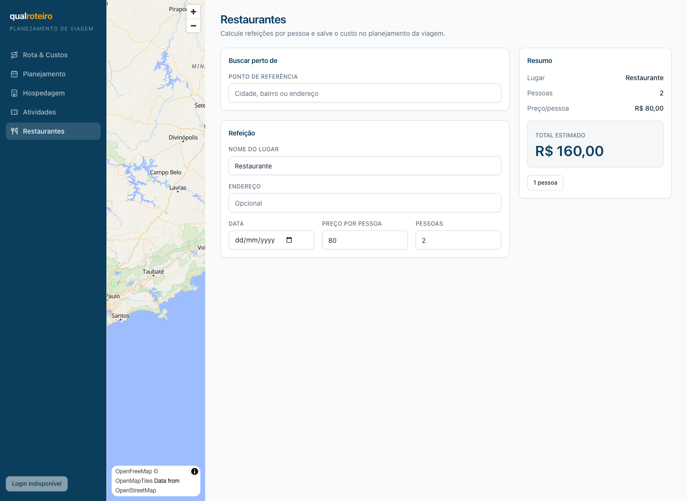
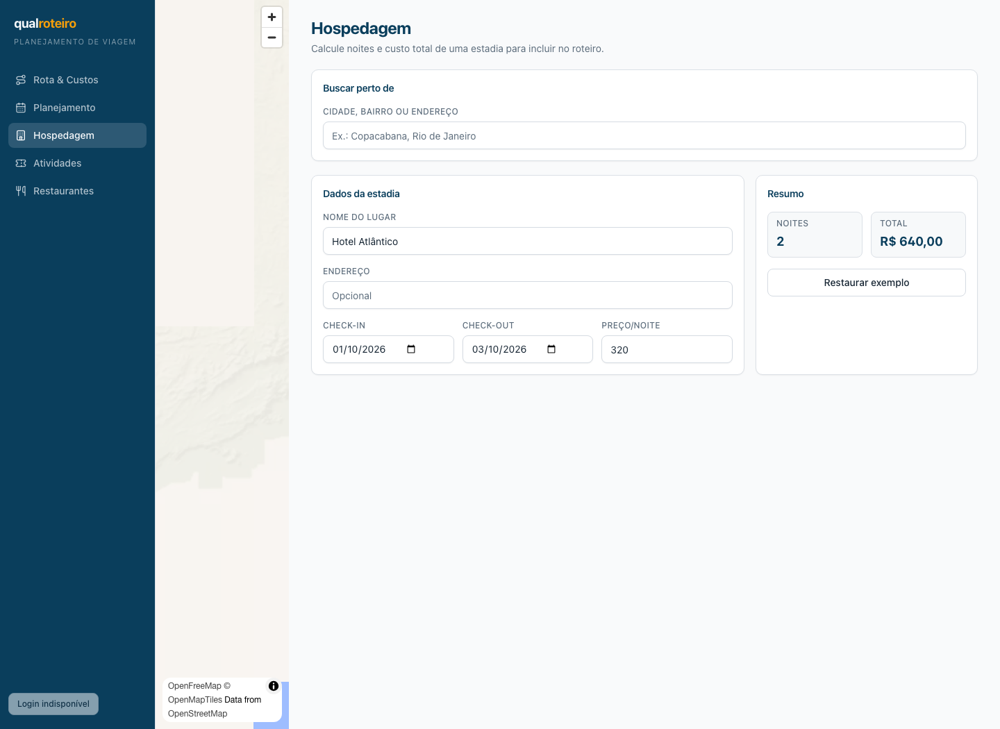
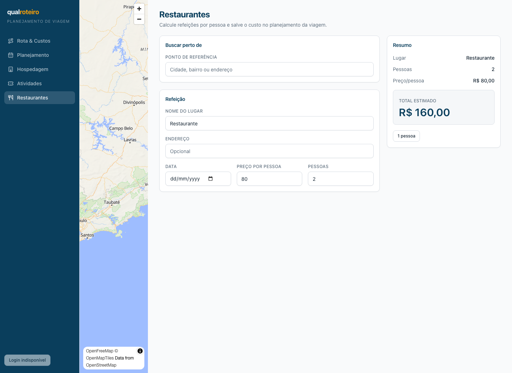

# Correção de front-end — A11Y-01 e LAYOUT-01

**Data:** 2026-09-16  
**Base:** `b894500` (`origin/main`)  
**Escopo de código:** `apps/web/**`; evidências e este relatório em `docs/qa/**`.

## Resultado

Os dois achados da revisão foram corrigidos sem alterar Rota & Custos,
Planejamento ou pacotes de domínio. A inspeção ocorreu contra o frontend real
local, sem mocks, em Chromium/Playwright 1.63.0 a 1440×1050.

| Achado | Resultado |
| --- | --- |
| A11Y-01 | Corrigido nos três formulários: associação, anúncio e mensagem junto ao campo. |
| LAYOUT-01 | Corrigido: Restaurantes agora compartilha o container, header, padding e título dos módulos irmãos; resumo preservado em `20rem`/320 px. |

## A11Y-01 — erro associado e anunciado

### Antes e depois

| Módulo | Antes (base `b894500`) | Depois |
| --- | --- | --- |
| Hospedagem | [print — erro no resumo e em inglês](evidence/hospedagem-error-before.png) | [print — `#lodging-price` inválido e mensagem local](evidence/hospedagem-error-after.png) |
| Atividades | [print — erro no resumo e em inglês](evidence/atividades-error-before.png) | [print — `#activity-people` inválido e mensagem local](evidence/atividades-error-after.png) |
| Restaurantes | [print — erro no resumo](evidence/restaurantes-error-before.png) | [print — `#restaurant-people` inválido e mensagem local](evidence/restaurantes-error-after.png) |

### Evidência de DOM

A execução Playwright preencheu `-1`/`0`, confirmou `aria-invalid="true"`, o
`aria-describedby` e o texto do elemento referenciado em cada tela. O registro
bruto está em [playwright-after.json](evidence/playwright-after.json).

| Seletor | `aria-describedby` | `role="alert"` / texto confirmado |
| --- | --- | --- |
| `#lodging-price` | `lodging-price-error` | `O preço por noite não pode ser negativo.` |
| `#activity-people` | `activity-people-error` | `Informe pelo menos uma pessoa.` |
| `#restaurant-people` | `restaurant-people-error` | `Informe pelo menos uma pessoa.` |

O estado de erro é calculado por campo, portanto um erro de outra validação não
marca indevidamente o input de preço/pessoas. Os erros remanescentes não
atribuíveis a esses controles continuam visíveis e anunciados no resumo.

### Arquivos exatos

- [Hospedagem — associação e alerta](/private/tmp/qualroteiro-frontend-a11y-layout/apps/web/src/modules/hospedagem/index.tsx:245); [mensagem em português](/private/tmp/qualroteiro-frontend-a11y-layout/apps/web/src/modules/hospedagem/calc.ts:18).
- [Atividades — associação e alerta](/private/tmp/qualroteiro-frontend-a11y-layout/apps/web/src/modules/atividades/index.tsx:249); [mensagens em português](/private/tmp/qualroteiro-frontend-a11y-layout/apps/web/src/modules/atividades/calc.ts:15).
- [Restaurantes — associação e alerta](/private/tmp/qualroteiro-frontend-a11y-layout/apps/web/src/modules/restaurantes/index.tsx:221).
- Cobertura: [Hospedagem](/private/tmp/qualroteiro-frontend-a11y-layout/apps/web/src/modules/hospedagem/hospedagem.test.tsx:45), [Atividades](/private/tmp/qualroteiro-frontend-a11y-layout/apps/web/src/modules/atividades/atividades.test.tsx:67) e [Restaurantes](/private/tmp/qualroteiro-frontend-a11y-layout/apps/web/src/modules/restaurantes/restaurantes.test.tsx:72).

## LAYOUT-01 — container de Restaurantes alinhado

Restaurantes passou a usar a mesma estrutura externa dos irmãos:
`mx-auto flex w-full max-w-5xl flex-col gap-5 px-4 py-6 md:px-8`, header com
`flex flex-col gap-1` e título `text-2xl font-bold tracking-tight text-primary`.
A grade interna mantém a coluna de resumo em `20rem` (equivalente a 320 px) e
o comportamento sticky.

| Antes — título dentro da primeira coluna e `font-semibold` | Depois — comparação a 1440px |
| --- | --- |
|  |   |

Medição do DOM após a correção, registrada em
[playwright-after.json](evidence/playwright-after.json): ambos têm largura de
seção **1024 px**, início em **416 px**, padding esquerdo/direito de **32 px**
e `font-weight: 700` no `h1`.

**Arquivo exato:** [estrutura alinhada](/private/tmp/qualroteiro-frontend-a11y-layout/apps/web/src/modules/restaurantes/index.tsx:124), [grade com resumo em `20rem`](/private/tmp/qualroteiro-frontend-a11y-layout/apps/web/src/modules/restaurantes/index.tsx:133), [sticky preservado](/private/tmp/qualroteiro-frontend-a11y-layout/apps/web/src/modules/restaurantes/index.tsx:245).

## Verificação

- Playwright visual e DOM: executado nas três entradas inválidas e na comparação Hospedagem × Restaurantes, viewport 1440×1050.
- Testes específicos dos módulos: **5 arquivos, 22 testes aprovados**.
- `pnpm -w build`: aprovado (8 tarefas).
- `pnpm -w typecheck`: aprovado (13 tarefas).
- `pnpm -w lint`: aprovado (3 tarefas).
- `pnpm -w test`: aprovado (13 tarefas; web: 23 arquivos e 132 testes).

## Escopo verificado

`git diff --name-only origin/main...HEAD` foi conferido antes da abertura da
PR: mudanças de produção ficam restritas a Hospedagem, Atividades e
Restaurantes dentro de `apps/web/**`; as demais mudanças são testes web e esta
evidência. Não há modificação em Rota & Custos, Planejamento ou pacote de
domínio.
